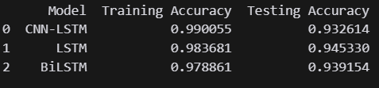

# googleplay_sentiment

## Create virtual environtment
- python -m venv .venv

## activate virtual environtment
### because I'm using windows
- in windows: .venv\Scripts\activate

## install requirements.txt
- pip install -r requirements.txt

## to get review dataset in google play run googleplay_scraper.ipynb
## notebook.ipynb to see the preprocessing dataset and model comparation
